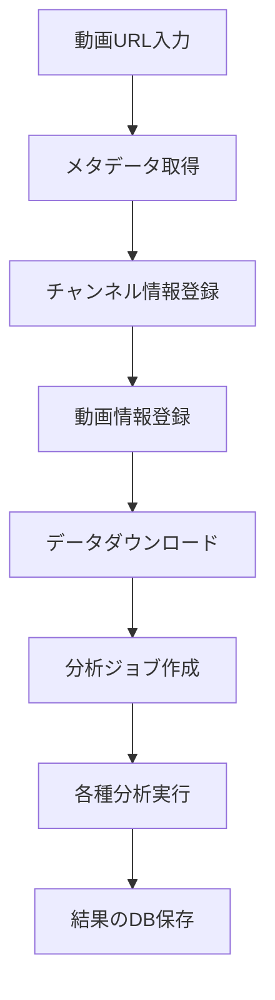

# YouTube データ登録プロセス概要

## データ登録コンポーネント

### 1. データ収集層コンポーネント
- **YouTubeDataCollector**: メタデータの取得と処理
- **VideoDownloader**: 動画・音声ファイルのダウンロード
- **YouTubeChatDownloader**: チャットログの取得と処理

### 2. データ永続化コンポーネント
- **DatabaseAdapter**: SQLiteデータベース操作用
- **SupabaseAdapter**: Supabaseデータベース操作用
- **IDConverter**: データベースID変換管理

## 登録プロセスフロー



## データベーステーブル構造

### 主要テーブル
1. **YouTubeChannels**: チャンネル情報
   - チャンネルID（主キー）
   - タイトル
   - 説明文
   
2. **Videos**: 動画メタデータ
   - 動画ID（主キー）
   - チャンネルID（外部キー）
   - タイトル
   - 説明文
   - 公開日時
   - 再生時間
   
3. **AnalysisJobs**: 分析ジョブ管理
   - ジョブID（主キー）
   - 動画ID（外部キー）
   - ステータス
   - 開始時間
   - 終了時間

4. **Volume_Analysis**: 音量分析結果
5. **Comment_Analysis**: コメント分析結果
6. **Audio_Emotion_Analysis**: 音声感情分析結果
7. **Video_Timestamps**: チャプター情報

## 主要メソッドとその機能

### チャンネル情報登録

```python
# IDConverter.pyの機能
def register_channel(self, channel_id):
    # チャンネルIDが既存かチェック
    # 存在しない場合は新規登録
    # チャンネルIDを返却

def register_channel_info(self, channel_id, title, description):
    # チャンネル情報を更新
    # タイトルと説明文を保存
```

### YouTubeDataCollector機能

```python
# youtube_data_collector.pyの機能
def get_channel_info(self, channel_id, save_to_db=False):
    # チャンネル情報をYouTubeから取得
    # save_to_db=Trueの場合はデータベースに保存
    # チャンネル情報を返却

def get_video_info(self, video_id):
    # 動画情報をYouTubeから取得
    # 動画メタデータを返却
```

## 最近の改善点（2025/04/30）

### `youtube_channels`テーブル問題の修正
- **問題**: チャンネルのタイトルと説明文がデータベースに保存されていなかった
- **修正内容**:
  1. **IDConverter.py**の修正:
     - チャンネル登録時にタイトルと説明も保存
     - 新規チャンネル作成時に仮のタイトル(チャンネルID)と空の説明を設定
     - `register_channel_info`メソッドを追加
  
  2. **youtube_data_collector.py**の修正:
     - `get_channel_info`メソッドに`save_to_db`パラメータを追加
     - データベースへの保存機能を実装
  
  3. **main.py**の修正:
     - チャンネル情報取得時に`save_to_db=True`を指定
  
  4. **update_all_channels.py**の作成:
     - 既存の全チャンネル情報を一括更新するためのスクリプト

## Supabase移行に関する注意点

SQLiteからSupabaseへの移行作業が進行中のため、以下の点に注意が必要:

1. **トランザクション管理の変更**:
   - 現行: `main.py`で一括してトランザクションを管理
   - 移行後: 各メソッドで完結するトランザクション管理
   - 実装: `db_adapter.commit(connection)`などを使用
   - 注意点: `connection.commit()`などの直接呼び出しは避ける

2. **データ型の互換性**:
   - NumPy型をJSON形式に変換できないエラーが発生する場合がある
   - 解決策: 保存前にPythonネイティブ型に変換する処理が必要

3. **既存データの取り扱い**:
   - 既存データの移行は不要
   - 新規データからSupabaseに保存する方針

## YouTube API制限への対応

1. **レート制限**:
   - 頻繁なアクセスでAPI制限に達する可能性あり
   - 対策: 取得済みデータのキャッシング活用

2. **認証対策**:
   - ブラウザCookieサポートによるYouTubeボット対策認証の回避機能実装

## 推奨実装方法

新規チャンネル・動画登録時は以下の手順を推奨:

1. `YouTubeDataCollector.get_channel_info(channel_id, save_to_db=True)`を呼び出し
2. 取得したチャンネル情報をもとに動画情報を取得
3. 取得した情報をもとにダウンロードと分析を実行
4. 分析結果をデータベースに保存

既存データの更新には`update_all_channels.py`スクリプトの活用を推奨