# Supabase データベーステーブル定義書

## 目次

1. [youtube_channels](#youtube_channels)
2. [videos](#videos)
3. [id_mapping](#id_mapping)
4. [highlight_candidates](#highlight_candidates)
5. [video_timestamps](#video_timestamps)
6. [analysis_results](#analysis_results)
7. [volume_analysis](#volume_analysis)
8. [volume_analysis_secondly](#volume_analysis_secondly)
9. [audio_emotion_analysis](#audio_emotion_analysis)
10. [comment_analysis](#comment_analysis)
11. [keyword_analysis](#keyword_analysis)
12. [keyword_settings](#keyword_settings)
13. [stamp_analysis](#stamp_analysis)
14. [stamp_settings](#stamp_settings)
15. [chat_messages](#chat_messages)
16. [transcriptions](#transcriptions)
17. [analysis_jobs](#analysis_jobs)

---

## youtube_channels

YouTube チャンネル情報を管理するテーブル。

| カラム名    | データ型                 | NULL 許容 | 主キー | デフォルト値 | 備考                  |
| ----------- | ------------------------ | --------- | ------ | ------------ | --------------------- |
| id          | bigint                   | ×         | ○      |              | 内部 ID（自動採番）   |
| channel_id  | text                     | ×         |        |              | YouTube チャンネル ID |
| title       | text                     | ○         |        |              | チャンネルタイトル    |
| description | text                     | ○         |        |              | チャンネル説明        |
| created_at  | timestamp with time zone | ○         |        | now()        | レコード作成日時      |
| updated_at  | timestamp with time zone | ○         |        | now()        | レコード更新日時      |

**関連テーブル**:

- videos (channel_id)

---

## videos

YouTube 動画情報を管理するテーブル。

| カラム名      | データ型                 | NULL 許容 | 主キー | デフォルト値 | 備考                                |
| ------------- | ------------------------ | --------- | ------ | ------------ | ----------------------------------- |
| id            | bigint                   | ×         | ○      |              | 内部 ID（自動採番）                 |
| video_id      | text                     | ×         |        |              | YouTube 動画 ID                     |
| channel_id    | bigint                   | ○         |        |              | youtube_channels テーブルの外部キー |
| title         | text                     | ○         |        |              | 動画タイトル                        |
| description   | text                     | ○         |        |              | 動画説明                            |
| duration      | bigint                   | ○         |        |              | 動画の長さ（秒）                    |
| published_at  | timestamp with time zone | ○         |        |              | YouTube での公開日時                |
| downloaded_at | timestamp with time zone | ○         |        |              | 動画ダウンロード日時                |
| processed_at  | timestamp with time zone | ○         |        |              | 動画処理完了日時                    |
| created_at    | timestamp with time zone | ○         |        | now()        | レコード作成日時                    |
| updated_at    | timestamp with time zone | ○         |        | now()        | レコード更新日時                    |

**関連テーブル**:

- youtube_channels (channel_id)
- highlight_candidates (video_id)
- volume_analysis (video_id)
- volume_analysis_secondly (video_id)
- video_timestamps (video_id)
- analysis_results (video_id)
- keyword_settings (video_id)
- keyword_analysis (video_id)
- comment_analysis (video_id)
- audio_emotion_analysis (video_id)
- stamp_settings (video_id)
- stamp_analysis (video_id)
- chat_messages (video_id)
- transcriptions (video_id)
- analysis_jobs (video_id)

---

## id_mapping

YouTube の動画 ID と内部 ID のマッピングを管理するテーブル。

| カラム名         | データ型                 | NULL 許容 | 主キー | デフォルト値         | 備考                      |
| ---------------- | ------------------------ | --------- | ------ | -------------------- | ------------------------- |
| youtube_video_id | text                     | ×         | ○      |                      | YouTube 動画 ID           |
| internal_id      | bigint                   | ×         |        |                      | システム内部で使用する ID |
| source           | text                     | ○         |        | 'videos_table'::text | ID の出所情報             |
| created_at       | timestamp with time zone | ○         |        | now()                | レコード作成日時          |

---

## highlight_candidates

ハイライト候補となる動画のセグメントを管理するテーブル。

| カラム名    | データ型                 | NULL 許容 | 主キー | デフォルト値 | 備考                        |
| ----------- | ------------------------ | --------- | ------ | ------------ | --------------------------- |
| id          | bigint                   | ×         | ○      |              | 内部 ID（自動採番）         |
| video_id    | bigint                   | ×         |        |              | videos テーブルの外部キー   |
| start_time  | bigint                   | ○         |        |              | 開始時間（秒）              |
| end_time    | bigint                   | ○         |        |              | 終了時間（秒）              |
| score       | double precision         | ○         |        |              | ハイライトスコア            |
| title       | text                     | ○         |        |              | ハイライトタイトル          |
| description | text                     | ○         |        |              | ハイライト説明              |
| factors     | text                     | ○         |        |              | ハイライト要因（JSON など） |
| is_auto     | boolean                  | ○         |        |              | 自動生成フラグ              |
| created_at  | timestamp with time zone | ○         |        | now()        | レコード作成日時            |
| updated_at  | timestamp with time zone | ○         |        | now()        | レコード更新日時            |

**関連テーブル**:

- videos (video_id)

---

## video_timestamps

動画のタイムスタンプ情報を管理するテーブル。

| カラム名     | データ型                 | NULL 許容 | 主キー | デフォルト値 | 備考                      |
| ------------ | ------------------------ | --------- | ------ | ------------ | ------------------------- |
| id           | bigint                   | ×         | ○      |              | 内部 ID（自動採番）       |
| video_id     | bigint                   | ×         |        |              | videos テーブルの外部キー |
| time_seconds | bigint                   | ○         |        |              | タイムスタンプ（秒）      |
| timestamp    | text                     | ○         |        |              | 時間表記（HH:MM:SS 形式） |
| title        | text                     | ○         |        |              | タイムスタンプのタイトル  |
| description  | text                     | ○         |        |              | タイムスタンプの説明      |
| is_auto      | boolean                  | ○         |        |              | 自動生成フラグ            |
| created_at   | timestamp with time zone | ○         |        | now()        | レコード作成日時          |
| updated_at   | timestamp with time zone | ○         |        | now()        | レコード更新日時          |

**関連テーブル**:

- videos (video_id)

---

## analysis_results

分析結果の統合データを管理するテーブル。

| カラム名      | データ型                 | NULL 許容 | 主キー | デフォルト値 | 備考                      |
| ------------- | ------------------------ | --------- | ------ | ------------ | ------------------------- |
| id            | bigint                   | ×         | ○      |              | 内部 ID（自動採番）       |
| video_id      | bigint                   | ×         |        |              | videos テーブルの外部キー |
| time_seconds  | bigint                   | ×         |        |              | 分析時間（秒）            |
| timestamp     | text                     | ×         |        |              | 時間表記（HH:MM:SS 形式） |
| volume_db     | double precision         | ○         |        |              | 音量（デシベル）          |
| comment_count | bigint                   | ○         |        |              | コメント数                |
| stamp_count   | bigint                   | ○         |        |              | スタンプ数                |
| keyword_count | bigint                   | ○         |        |              | キーワード出現数          |
| created_at    | timestamp with time zone | ○         |        | now()        | レコード作成日時          |
| updated_at    | timestamp with time zone | ○         |        | now()        | レコード更新日時          |

**関連テーブル**:

- videos (video_id)

---

## volume_analysis

音量分析データを管理するテーブル。

| カラム名         | データ型                 | NULL 許容 | 主キー | デフォルト値 | 備考                         |
| ---------------- | ------------------------ | --------- | ------ | ------------ | ---------------------------- |
| id               | bigint                   | ×         | ○      |              | 内部 ID（自動採番）          |
| video_id         | bigint                   | ×         |        |              | videos テーブルの外部キー    |
| time_seconds     | bigint                   | ○         |        |              | 分析時間（秒）               |
| timestamp        | text                     | ○         |        |              | 時間表記（HH:MM:SS 形式）    |
| volume_db        | double precision         | ○         |        |              | 音量（デシベル）             |
| normalized_score | double precision         | ○         |        |              | 正規化されたスコア（0-1）    |
| created_at       | timestamp with time zone | ○         |        | now()        | レコード作成日時             |
| updated_at       | timestamp with time zone | ○         |        | now()        | レコード更新日時             |
| relative_change  | double precision         | ○         |        |              | 相対音量（前後の音量との差） |

**関連テーブル**:

- videos (video_id)

---

## volume_analysis_secondly

1 秒単位の詳細な音量分析データを管理するテーブル。

| カラム名              | データ型                 | NULL 許容 | 主キー | デフォルト値 | 備考                                 |
| --------------------- | ------------------------ | --------- | ------ | ------------ | ------------------------------------ |
| id                    | bigint                   | ×         | ○      |              | 内部 ID（自動採番）                  |
| video_id              | bigint                   | ×         |        |              | videos テーブルの外部キー            |
| time_seconds          | bigint                   | ×         |        |              | 分析開始時間（秒）                   |
| timestamp             | text                     | ×         |        |              | 時間表記（HH:MM:SS 形式）            |
| analysis_second       | bigint                   | ×         |        |              | 分析秒数                             |
| rel_net_change        | double precision         | ○         |        |              | 相対的な純変化量                     |
| rel_max_positive_diff | double precision         | ○         |        |              | 相対的な最大正変化量                 |
| rel_sum_of_abs_diff   | double precision         | ○         |        |              | 相対的な絶対差分合計                 |
| abs_db_mean           | double precision         | ○         |        |              | 平均音量（dB）                       |
| abs_db_max            | double precision         | ○         |        |              | 最大音量（dB）                       |
| abs_db_min            | double precision         | ○         |        |              | 最小音量（dB）                       |
| created_at            | timestamp with time zone | ○         |        | now()        | レコード作成日時                     |
| updated_at            | timestamp with time zone | ○         |        | now()        | レコード更新日時                     |
| inter_mean_delta      | real                     | ○         |        |              | 前秒比の平均音量差                   |
| inter_max_delta       | real                     | ○         |        |              | 前秒比の最大音量差                   |
| inter_min_delta       | real                     | ○         |        |              | 前秒比の最小音量差                   |
| dynamic_range         | real                     | ○         |        |              | 同一秒内の音量振れ幅                 |
| norm_mean             | real                     | ○         |        |              | 0-1 に正規化された平均音量           |
| smooth_mean           | real                     | ○         |        |              | 3 秒移動平均音量                     |
| is_peak               | integer                  | ○         |        | 0            | 盛り上がりポイント判定 (-3dB 以上=1) |
| is_silent             | integer                  | ○         |        | 0            | 無音区間判定 (-50dB 以下=1)          |

**関連テーブル**:

- videos (video_id)

---

## audio_emotion_analysis

音声感情分析データを管理するテーブル。

| カラム名         | データ型                 | NULL 許容 | 主キー | デフォルト値     | 備考                         |
| ---------------- | ------------------------ | --------- | ------ | ---------------- | ---------------------------- |
| id               | bigint                   | ×         | ○      |                  | 内部 ID（自動採番）          |
| video_id         | bigint                   | ×         |        |                  | videos テーブルの外部キー    |
| time_seconds     | bigint                   | ○         |        |                  | 分析時間（秒）               |
| timestamp        | text                     | ○         |        |                  | 時間表記（HH:MM:SS 形式）    |
| emotion_type     | text                     | ○         |        |                  | 感情タイプ（笑い、悲鳴など） |
| confidence_score | double precision         | ○         |        |                  | 信頼度スコア                 |
| normalized_score | double precision         | ○         |        |                  | 正規化されたスコア（0-1）    |
| detection_mode   | text                     | ○         |        | 'standard'::text | 検出モード                   |
| start_time       | double precision         | ○         |        |                  | 開始時間（秒、小数部あり）   |
| end_time         | double precision         | ○         |        |                  | 終了時間（秒、小数部あり）   |
| created_at       | timestamp with time zone | ○         |        | now()            | レコード作成日時             |
| updated_at       | timestamp with time zone | ○         |        | now()            | レコード更新日時             |

**関連テーブル**:

- videos (video_id)

---

## comment_analysis

コメント分析データを管理するテーブル。

| カラム名         | データ型                 | NULL 許容 | 主キー | デフォルト値 | 備考                      |
| ---------------- | ------------------------ | --------- | ------ | ------------ | ------------------------- |
| id               | bigint                   | ×         | ○      |              | 内部 ID（自動採番）       |
| video_id         | bigint                   | ×         |        |              | videos テーブルの外部キー |
| time_seconds     | bigint                   | ○         |        |              | 分析時間（秒）            |
| timestamp        | text                     | ○         |        |              | 時間表記（HH:MM:SS 形式） |
| comment_count    | bigint                   | ○         |        |              | コメント数                |
| normalized_score | double precision         | ○         |        |              | 正規化されたスコア（0-1） |
| created_at       | timestamp with time zone | ○         |        | now()        | レコード作成日時          |
| updated_at       | timestamp with time zone | ○         |        | now()        | レコード更新日時          |

**関連テーブル**:

- videos (video_id)

---

## keyword_analysis

キーワード分析データを管理するテーブル。

| カラム名         | データ型                 | NULL 許容 | 主キー | デフォルト値 | 備考                      |
| ---------------- | ------------------------ | --------- | ------ | ------------ | ------------------------- |
| id               | bigint                   | ×         | ○      |              | 内部 ID（自動採番）       |
| video_id         | bigint                   | ×         |        |              | videos テーブルの外部キー |
| time_seconds     | bigint                   | ○         |        |              | 分析時間（秒）            |
| timestamp        | text                     | ○         |        |              | 時間表記（HH:MM:SS 形式） |
| keyword          | text                     | ○         |        |              | 検出されたキーワード      |
| keyword_count    | bigint                   | ○         |        |              | キーワード出現数          |
| normalized_score | double precision         | ○         |        |              | 正規化されたスコア（0-1） |
| created_at       | timestamp with time zone | ○         |        | now()        | レコード作成日時          |
| updated_at       | timestamp with time zone | ○         |        | now()        | レコード更新日時          |

**関連テーブル**:

- videos (video_id)

---

## keyword_settings

キーワード設定を管理するテーブル。

| カラム名   | データ型                 | NULL 許容 | 主キー | デフォルト値 | 備考                      |
| ---------- | ------------------------ | --------- | ------ | ------------ | ------------------------- |
| id         | bigint                   | ×         | ○      |              | 内部 ID（自動採番）       |
| video_id   | bigint                   | ×         |        |              | videos テーブルの外部キー |
| keyword    | text                     | ○         |        |              | 検索対象キーワード        |
| created_at | timestamp with time zone | ○         |        | now()        | レコード作成日時          |
| updated_at | timestamp with time zone | ○         |        | now()        | レコード更新日時          |

**関連テーブル**:

- videos (video_id)

---

## stamp_analysis

スタンプ（絵文字リアクション）分析データを管理するテーブル。

| カラム名         | データ型                 | NULL 許容 | 主キー | デフォルト値 | 備考                      |
| ---------------- | ------------------------ | --------- | ------ | ------------ | ------------------------- |
| id               | bigint                   | ×         | ○      |              | 内部 ID（自動採番）       |
| video_id         | bigint                   | ×         |        |              | videos テーブルの外部キー |
| time_seconds     | bigint                   | ○         |        |              | 分析時間（秒）            |
| timestamp        | text                     | ○         |        |              | 時間表記（HH:MM:SS 形式） |
| stamp_code       | text                     | ○         |        |              | スタンプコード            |
| stamp_count      | bigint                   | ○         |        |              | スタンプ数                |
| normalized_score | double precision         | ○         |        |              | 正規化されたスコア（0-1） |
| created_at       | timestamp with time zone | ○         |        | now()        | レコード作成日時          |
| updated_at       | timestamp with time zone | ○         |        | now()        | レコード更新日時          |

**関連テーブル**:

- videos (video_id)

---

## stamp_settings

スタンプ（絵文字リアクション）設定を管理するテーブル。

| カラム名   | データ型                 | NULL 許容 | 主キー | デフォルト値 | 備考                      |
| ---------- | ------------------------ | --------- | ------ | ------------ | ------------------------- |
| id         | bigint                   | ×         | ○      |              | 内部 ID（自動採番）       |
| video_id   | bigint                   | ×         |        |              | videos テーブルの外部キー |
| stamp_code | text                     | ○         |        |              | 検索対象スタンプコード    |
| created_at | timestamp with time zone | ○         |        | now()        | レコード作成日時          |
| updated_at | timestamp with time zone | ○         |        | now()        | レコード更新日時          |

**関連テーブル**:

- videos (video_id)

---

## chat_messages

ライブチャットメッセージを管理するテーブル。

| カラム名     | データ型                 | NULL 許容 | 主キー | デフォルト値 | 備考                      |
| ------------ | ------------------------ | --------- | ------ | ------------ | ------------------------- |
| id           | bigint                   | ×         | ○      |              | 内部 ID（自動採番）       |
| video_id     | bigint                   | ×         |        |              | videos テーブルの外部キー |
| timestamp    | text                     | ○         |        |              | 時間表記（HH:MM:SS 形式） |
| name         | text                     | ○         |        |              | ユーザー名                |
| message      | text                     | ○         |        |              | メッセージ内容            |
| message_type | text                     | ○         |        |              | メッセージタイプ          |
| time_seconds | bigint                   | ○         |        |              | 投稿時間（秒）            |
| created_at   | timestamp with time zone | ○         |        | now()        | レコード作成日時          |
| updated_at   | timestamp with time zone | ○         |        | now()        | レコード更新日時          |

**関連テーブル**:

- videos (video_id)

---

## transcriptions

動画の文字起こしデータを管理するテーブル。

| カラム名      | データ型                 | NULL 許容 | 主キー | デフォルト値 | 備考                      |
| ------------- | ------------------------ | --------- | ------ | ------------ | ------------------------- |
| id            | bigint                   | ×         | ○      |              | 内部 ID（自動採番）       |
| video_id      | bigint                   | ×         |        |              | videos テーブルの外部キー |
| time_seconds  | bigint                   | ×         |        |              | 文字起こし時間（秒）      |
| transcription | text                     | ×         |        |              | 文字起こしテキスト        |
| refined_text  | text                     | ○         |        |              | 修正・整形されたテキスト  |
| created_at    | timestamp with time zone | ○         |        | now()        | レコード作成日時          |
| updated_at    | timestamp with time zone | ○         |        | now()        | レコード更新日時          |
| timestamp     | text                     | ○         |        |              | 時間表記（HH:MM:SS 形式） |

**関連テーブル**:

- videos (video_id)

---

## analysis_jobs

分析ジョブを管理するテーブル。

| カラム名      | データ型                 | NULL 許容 | 主キー | デフォルト値 | 備考                                                    |
| ------------- | ------------------------ | --------- | ------ | ------------ | ------------------------------------------------------- |
| id            | bigint                   | ×         | ○      |              | 内部 ID（自動採番）                                     |
| video_id      | bigint                   | ×         |        |              | videos テーブルの外部キー                               |
| job_type      | text                     | ○         |        |              | ジョブタイプ（音量分析、コメント分析など）              |
| status        | text                     | ○         |        |              | ジョブステータス（pending, running, completed, failed） |
| started_at    | timestamp with time zone | ○         |        |              | ジョブ開始日時                                          |
| completed_at  | timestamp with time zone | ○         |        |              | ジョブ完了日時                                          |
| error_message | text                     | ○         |        |              | エラーメッセージ                                        |
| parameters    | text                     | ○         |        |              | ジョブパラメータ（JSON 形式）                           |
| created_at    | timestamp with time zone | ○         |        | now()        | レコード作成日時                                        |
| updated_at    | timestamp with time zone | ○         |        | now()        | レコード更新日時                                        |

**関連テーブル**:

- videos (video_id)

---

## データベース ER 図

```mermaid
erDiagram
    youtube_channels ||--o{ videos : "has"
    videos ||--o{ highlight_candidates : "has"
    videos ||--o{ video_timestamps : "has"
    videos ||--o{ analysis_results : "has"
    videos ||--o{ volume_analysis : "has"
    videos ||--o{ volume_analysis_secondly : "has"
    videos ||--o{ audio_emotion_analysis : "has"
    videos ||--o{ comment_analysis : "has"
    videos ||--o{ keyword_analysis : "has"
    videos ||--o{ keyword_settings : "has"
    videos ||--o{ stamp_analysis : "has"
    videos ||--o{ stamp_settings : "has"
    videos ||--o{ chat_messages : "has"
    videos ||--o{ transcriptions : "has"
    videos ||--o{ analysis_jobs : "has"

    youtube_channels {
        bigint id PK
        text channel_id
        text title
        text description
        timestamp created_at
        timestamp updated_at
    }

    videos {
        bigint id PK
        text video_id
        bigint channel_id FK
        text title
        text description
        bigint duration
        timestamp published_at
        timestamp downloaded_at
        timestamp processed_at
        timestamp created_at
        timestamp updated_at
    }

    id_mapping {
        text youtube_video_id PK
        bigint internal_id
        text source
        timestamp created_at
    }

    highlight_candidates {
        bigint id PK
        bigint video_id FK
        bigint start_time
        bigint end_time
        float score
        text title
        text description
        text factors
        boolean is_auto
        timestamp created_at
        timestamp updated_at
    }

    video_timestamps {
        bigint id PK
        bigint video_id FK
        bigint time_seconds
        text timestamp
        text title
        text description
        boolean is_auto
        timestamp created_at
        timestamp updated_at
    }

    analysis_results {
        bigint id PK
        bigint video_id FK
        bigint time_seconds
        text timestamp
        float volume_db
        bigint comment_count
        bigint stamp_count
        bigint keyword_count
        timestamp created_at
        timestamp updated_at
    }

    volume_analysis {
        bigint id PK
        bigint video_id FK
        bigint time_seconds
        text timestamp
        float volume_db
        float normalized_score
        float relative_change
        timestamp created_at
        timestamp updated_at
    }

    volume_analysis_secondly {
        bigint id PK
        bigint video_id FK
        bigint time_seconds
        text timestamp
        bigint analysis_second
        float rel_net_change
        float rel_max_positive_diff
        float rel_sum_of_abs_diff
        float abs_db_mean
        float abs_db_max
        float abs_db_min
        float inter_mean_delta
        float inter_max_delta
        float inter_min_delta
        float dynamic_range
        float norm_mean
        float smooth_mean
        integer is_peak
        integer is_silent
        timestamp created_at
        timestamp updated_at
    }

    audio_emotion_analysis {
        bigint id PK
        bigint video_id FK
        bigint time_seconds
        text timestamp
        text emotion_type
        float confidence_score
        float normalized_score
        text detection_mode
        float start_time
        float end_time
        timestamp created_at
        timestamp updated_at
    }

    comment_analysis {
        bigint id PK
        bigint video_id FK
        bigint time_seconds
        text timestamp
        bigint comment_count
        float normalized_score
        timestamp created_at
        timestamp updated_at
    }

    keyword_analysis {
        bigint id PK
        bigint video_id FK
        bigint time_seconds
        text timestamp
        text keyword
        bigint keyword_count
        float normalized_score
        timestamp created_at
        timestamp updated_at
    }

    keyword_settings {
        bigint id PK
        bigint video_id FK
        text keyword
        timestamp created_at
        timestamp updated_at
    }

    stamp_analysis {
        bigint id PK
        bigint video_id FK
        bigint time_seconds
        text timestamp
        text stamp_code
        bigint stamp_count
        float normalized_score
        timestamp created_at
        timestamp updated_at
    }

    stamp_settings {
        bigint id PK
        bigint video_id FK
        text stamp_code
        timestamp created_at
        timestamp updated_at
    }

    chat_messages {
        bigint id PK
        bigint video_id FK
        text timestamp
        text name
        text message
        text message_type
        bigint time_seconds
        timestamp created_at
        timestamp updated_at
    }

    transcriptions {
        bigint id PK
        bigint video_id FK
        bigint time_seconds
        text transcription
        text refined_text
        text timestamp
        timestamp created_at
        timestamp updated_at
    }

    analysis_jobs {
        bigint id PK
        bigint video_id FK
        text job_type
        text status
        timestamp started_at
        timestamp completed_at
        text error_message
        text parameters
        timestamp created_at
        timestamp updated_at
    }
```

