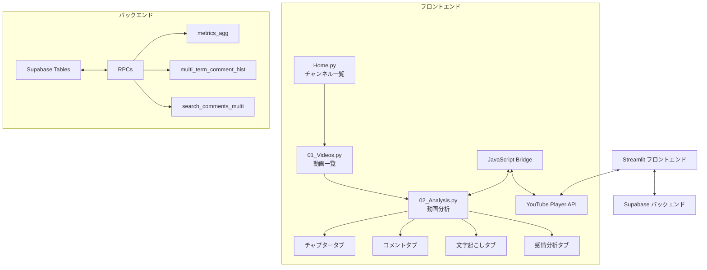
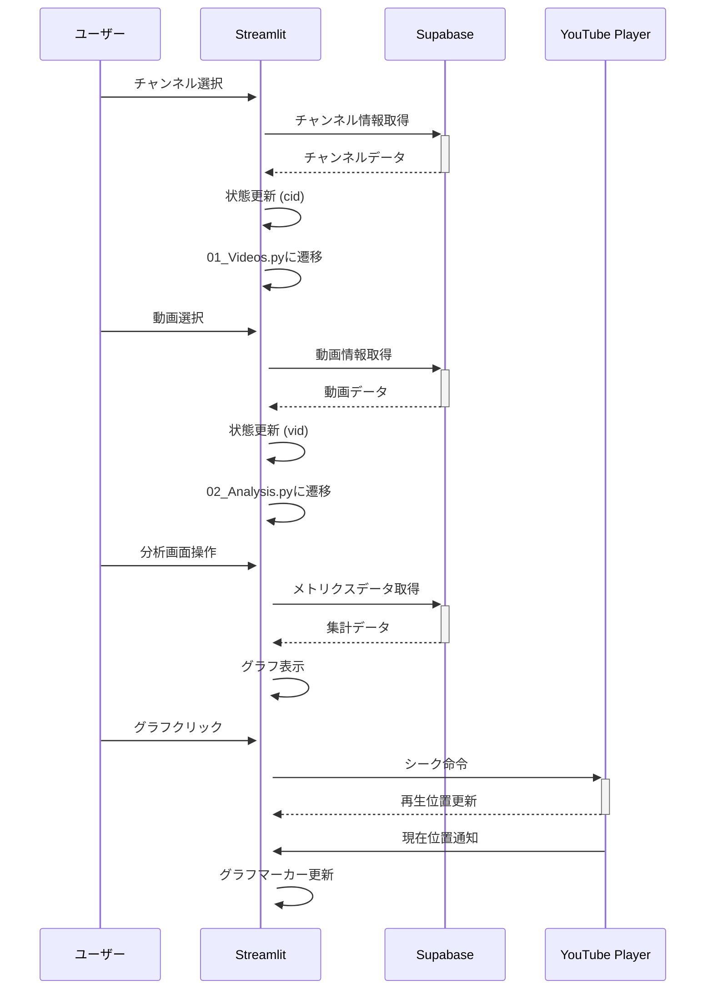

# システムパターン：YouTube データ分析可視化サービス

## システムアーキテクチャ

このアプリケーションは、Streamlit フロントエンド、Supabase バックエンド、YouTube プレイヤー連携という 3 つの主要コンポーネントで構成されています。



## 主要コンポーネントと責務

### フロントエンド（Streamlit）

1. **Home.py（チャンネル一覧画面）**：

   - チャンネル情報の取得と表示
   - チャンネル検索フィルタリング
   - チャンネル選択による画面遷移管理

2. **01_Videos.py（動画一覧画面）**：

   - 選択されたチャンネルの動画一覧表示
   - 動画選択機能
   - ページネーション処理
   - 分析画面への遷移制御

3. **02_Analysis.py（動画分析画面）**：

   - YouTube プレイヤー埋め込み
   - 共通コントロールパネル管理
   - メトリクスグラフ表示
   - タブ切り替え制御
   - 各タブの専用コンテンツ表示

4. **JS ブリッジコンポーネント**：
   - Streamlit→YouTube Player 通信（シーク命令）
   - YouTube Player→Streamlit 通信（現在再生位置）

### バックエンド（Supabase）

1. **データアクセス層**：

   - テーブルへの直接クエリ
   - RPC を通じた高度なデータ操作

2. **RPC 関数群**：

   - `metrics_agg`：メトリクスデータ集計
   - `multi_term_comment_hist`：複数検索語のコメント頻度集計
   - `search_comments_multi`：複数検索語でのコメント検索

3. **キャッシュ戦略**：
   - Streamlit の`st.cache_data`によるデータキャッシュ
   - 適切な TTL（Time To Live）設定による最適化

## 設計パターン

### 1. マルチページアプリ構造

Streamlit のマルチページアプリケーション構造を採用し、論理的なナビゲーションフローを実現。

```
Home.py
└── pages/
    ├── 01_Videos.py
    └── 02_Analysis.py
```

### 2. 状態管理パターン

Streamlit の`st.session_state`を使用して、ページ間の状態を維持します。

```python
# 状態の設定
st.session_state['cid'] = selected_channel_id

# 他のページでの状態の参照
if 'cid' in st.session_state:
    channel_id = st.session_state['cid']
```

### 3. コンポーネント分離パターン

再利用可能な UI コンポーネントを関数として分離し、コードの重複を防ぎます。

```python
def display_metrics_graph():
    """メトリクスグラフ（音量とコメント頻度）を表示する関数"""
    # グラフ表示ロジック

# 各タブで共通のグラフを表示
display_metrics_graph()
```

### 4. データフェッチとキャッシュ戦略

`@st.cache_data`デコレータを使用して、パフォーマンスを最適化します。

```python
@st.cache_data(ttl=60)
def get_chapters(video_id):
    result = supabase.table('video_timestamps').select('*').eq('video_id', video_id).order('time_seconds').execute()
    return result['data']
```

### 5. イベント駆動型 UI パターン

ユーザーアクションに応じたイベント処理を実装し、インタラクティブな UI 体験を実現します。

```python
# グラフクリックイベント処理
selected_points = plotly_events(fig, click_event=True)
if selected_points:
    point = selected_points[0]
    st.session_state['sec'] = point['x']
```

### 6. JavaScript-Python 橋渡しパターン

`st.components.v1.html`を使用して、JavaScript と Python 間の通信を実現します。

```python
# YouTubeプレイヤーからの現在位置更新通知を受け取る
js_code = """
<script>
window.addEventListener('message', function(e) {
    if (e.data.type === 'tick') {
        window.parent.postMessage({
            type: 'streamlit:setComponentValue',
            value: e.data.sec
        }, '*');
    }
});
</script>
"""
current_time = st.components.v1.html(js_code, height=0)
```

## データフロー



## コンポーネント間のインターフェース

1. **Streamlit-Supabase インターフェース**：

   - supabase-py クライアントを使用したテーブルクエリと RPC 呼び出し
   - 結果の JSON から Python オブジェクトへの変換

2. **Streamlit-YouTube Player インターフェース**：

   - `postMessage` API を使用したブラウザウィンドウ間通信
   - シーク命令と再生位置通知のメッセージタイプ定義

3. **タブ間インターフェース**：
   - 共通のセッション状態による情報共有
   - 共通のユーティリティ関数（時間フォーマットなど）
